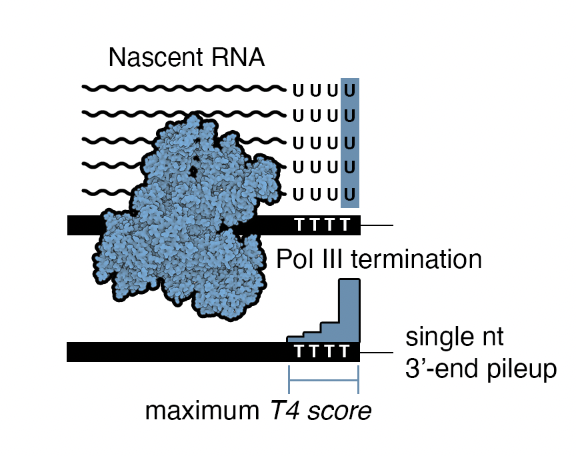

# Overview:

Pol III transcription termination relies on complementary binding between nascent RNA and a relatively short repeat of 4 to 6 Thymidine (T) sequences on the non-template DNA strand. The Pol III termination signature is unique from Pol I, which relies on a relatively long T-tract 15, as well as Pol II termination signals, which facilitate cleavage and polyadenylation of mRNA. We therefore developed a framework for scoring global patterns of single nucleotide 3’-end pileup at minimal sequences of 4 Ts (“T4”) as a molecular breadcrumb of Pol III transcription. This repository includes processed files and details related to our manuscript: KC et al., ...

# Data processing:

We retrieved all available nascent PRO-seq (Precision Run-on Sequencing) datasets available via ENCODE corresponding to 18 distinct experiments across 7 different cell lines. To ascertain strand specificity, we employed the infer_experiment code from the RSeQC42 package and filtered out 5 experiments with a strand specificity of less than 85%. Subsequently, we utilized genomecov from BEDtools43 to determine the 3' pileup of reads, employing the flags "-dz -3". T4 motifs (TTTT) were identified within the hg38 genome using SeqKit44, with a 3-nt cushion applied on either side of the T4 motif, resulting in a 10-nt long T4 motif. For each T4 motif instance, we compute the poisson probability of observing the T4 read pileup compared   with the maximum lambda (expected signal) at 20 bp and 50 bp surrounding the T4 motif. 

